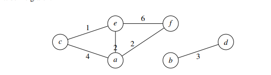
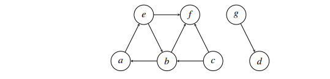

# Algdat eskamen 2019

### Oppgave 4
#### a)  Sett tallene 2, 4, 1, 3, 7, 0, 9 inn i en min-heap. Sett dem inn i den rekkefølgen de står, og tegn opp heapen en gang for hvert tall du setter inn.

    2

        2
    4

        1
    4       2

            1
        3       2
       4

            1
        3       2
      4   7   

            0
        3       1
      4   7   2

            0
        3       1
      4   7    2 9

#### b) Sett de samme tallene inn i et binært søketre. Sett dem inn den rekkefølgen de står, og tegn opp søketreet en gang for hvert tall du setter inn.

        2

        2
            4
    
        2
    1       4

        2
    1       4
          3

        2
    1       4
          3   7

    
            2
        1       4
       0       3  7

            2
        1       4
    0        3      7
                      9

### Oppgave 5
#### a) Demonstrer Burrows-Wheeler-transformasjonen på ordet «auauau»
'auauau
a'uauau
au'auau
aua'uau
auau'au
auaua'u
auauau'

sortet order

auauau'
auaua'u
au'auau
uauau'a
uau'aua
u'auaua
'auauau

'uuaaau
#### b) Beskriv halting-problemet, og forklar hvorfor det ikke er løsbart.

Beskrivelse: Halting-problemet går ut på å kunne si hvorvidt et program vil stoppe eller
ikke, med en gitt input. Et program som løser dette problemet, vil altså ta et annet program
som input.
Det er generelt uløselig, fordi: La oss si at vi har et program H, som løser halting-problemet.
Da kan vi lage et program P,som tar et program X som input. Ved hjelp av H sjekker P om
X vil stoppe eller ikke når det får sin egen kildekode som input. Hvis H sier X vil stoppe,
kjører P en uendelig løkke. Hvis H sier X stopper ikke, vil P avslutte.
Hvis vi kjører P med sin egen programkode som input, får vi en umulig situasjon. Altså er
programmet H umulig.

### Oppgave 6
#### a)
    public void oppg_a(int n, int m, int [][] tab) {
        for (int i=0; i <= n-1; ++i) {
            for (int j=0; j<m*m; j++) {
                for (int k=1; k<i; ++k) tab[i][k] *= j;
            }
        }
    }

O(n^2 m^2) = O((n*m)^2)

#### b)
    public void oppg_b(int n, int m, int [] tab) {
        if (n > m) return;
        for (int i=0; i <= n-1; ++i) {
            for (int j=0; j<m; j+=3) {
                tab[i+j*n] = 5;
            }
        }
    }

omega(1) O(n*m)

#### c)
    public void oppg_c(int n, int[][] tab, int x) {
        for (int j=0; j < n-1; ++j) {
            for (int k = n; k>0; --k) tab[j][k]+=x;
        }
        if (n>0) oppg_c(n/2, tab, x/3);
    }

T(n) = T(n/2) + cn^2

2^2 > 1 = theta(n^2)

#### d)
    public void oppg_d(int n, int[] tab, int x) {
        tab[x] += n;
        if (n>0) {
            oppg_d(n/2, tab, x/3+1);
            oppg_d(n/2, tab, x/3-1);
            oppg_d(n/2, tab, 2*x/3+1);
            oppg_d(n/2, tab, 2*x/3-1);
        }
    }
T(n) = 4*T(n/2) + 1

2^1 < 4 = theta(n^log2 4) == theta(n^2) fordi log2 4 == 2

### Oppgave 7 
### Det er 968 postnumre i Nord-Norge. Jeg vil lagre disse i en hashtabell med dobbel hashing. Foreslå hashfunksjoner og tabellstørrelse så jeg får effektive oppslag og rimelig bruk av plass. Forklar valg du gjør.

Velger tabell størrelse 1013 fordi dette er et primtall og er større en antall postnr som gjør at det alltid vil være plass til postnrene.

    int hash1(int key){
        return key%tabell_lengde  //1013
    }

    int hash2(int key){
        retun (key%tabell_lengde-1) + 1
    }

hash1 vil hashe til en plass innen for tabell lengden 1013 fordi vi bruker rest divisjon sammen med tabell lengden vi gi ett tall fra 0 til 1012 has2 to så bruker vi rest divisjon med tabell_lengden -1 dette vil da gi oss en plass mellom 0 til 1011 så legger vi til en sånn at vi ungår å få 0 som verdi og området blir da 1 til 1012 dette fyller da alle kravene til en dobbel hash hashtabell

### Oppgave 8

#### a) Finn og tegn et minimalt spenntre med vekt, eller forklar hvorfor det ikke er mulig.
Ikke mulig fordi grafen henger ikke sammen

#### b) Finn korteste vei fra 𝑐 til de andre nodene. Tegn korteste-vei treet
c-e: 1
c-e-a:3
c-e-a-f:5
b og d er ikke sammenengede med resten av grafen så de får udedelig vekt

#### c)Gitt denne grafen:

###Finn de sterkt sammenhengende komponentene, eller forklar hvorfor det ikke er mulig.

a-e-b, f, c, g, d

